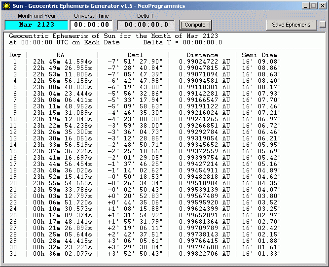



## Sun\_Ephemeris

### Description

<pre>

SUN EPHEMERIS GENERATOR V1.5

Program written by Jay Tanner - Jay@NeoProgrammics.com

It was built around revision 6 of the VSOP87 core modules.

----

The program is based on an implementation of the full VSOP87 theory

computations of the orbit of Sun in spherical variables.

The original VSOP theory was developed of Pierre Bretagnon et al. of

the Bureau des Longitudes in Paris and was implemented in the FORTRAN

computer language.

Theoretically, the heliocentric coordinates upon which the geocentric

computations are based are accurate to within an arcsecond or better

over the range from 2000 BC to 6000 AD in the case of the inner

planets, Mercury to Mars.

Due to the popularity of Microsoft Visual BASIC and the much faster

speed of modern computers, I thought it was about time to develop a

version of the theory that would be more accessible to the amateur

astronomers with Windows PC computers. The result of that effort is

the development of a series of ephemeris generating programs for the

Sun and the eight major planets from Mercury to Neptune.

The computations of the planetary positions include the interacting

gravitational perturbations of the planets, precession, the long-term

effects of relativity, light-time, aberration and nutation. Then the

coordinates of the planets are reduced from the dynamical coordinates

of the VSOP87 theory to the apparent geocentric coordinates according

the standard J2000 FK5 system of coordinates. Consequently, the

computations compare very favorably with the published ephemerides.

The basic ephemeris computations are:

Apparent Geocentric:

Right Ascension

Declination

Distance to the sun

Semidiameter

The planetary orbits are determined by the computation of three

spherical variables.

These variables are:

L = Heliocentric longitude

B = Heliocentric latitude

R = Radius vector or distance between centers of Earth and Sun

Program Statistics for the Sun ephemeris program:

Total Computational Term Counts For the VSOP87 Orbit of EARTH are:

Total # L Terms: 1080

Total # B Terms: 348

Total # R Terms: 997

Total All Terms: 2425

The Earth module is used to compute the position of the sun. This is

the simplest case, since the Sun may be considered directly opposite

the Earth. In this case, the position of the Earth is computed and

180 degrees is added to its heliocentric longitude and the sign of

the Earth's heliocentric latitude is reversed. The radius vector

requires no modification.

----

</pre>
 
### More Info
 
Data and Time

High precision ephemeris of geocentric solar coordinates over an 8000 year period.

             |
---                |---
**Submitted On**   |2001-02-05 10:13:44
**By**             |[Jay Tanner](https://github.com/Planet-Source-Code/PSCIndex/blob/master/ByAuthor/jay-tanner.md)
**Level**          |Advanced
**User Rating**    |4.4 (22 globes from 5 users)
**Compatibility**  |VB 6\.0
**Category**       |[Complete Applications](https://github.com/Planet-Source-Code/PSCIndex/blob/master/ByCategory/complete-applications__1-27.md)
**World**          |[Visual Basic](https://github.com/Planet-Source-Code/PSCIndex/blob/master/ByWorld/visual-basic.md)
**Archive File**   |[CODE\_UPLOAD14550252001\.zip](https://github.com/Planet-Source-Code/jay-tanner-sun-ephemeris__1-15026/archive/master.zip)

